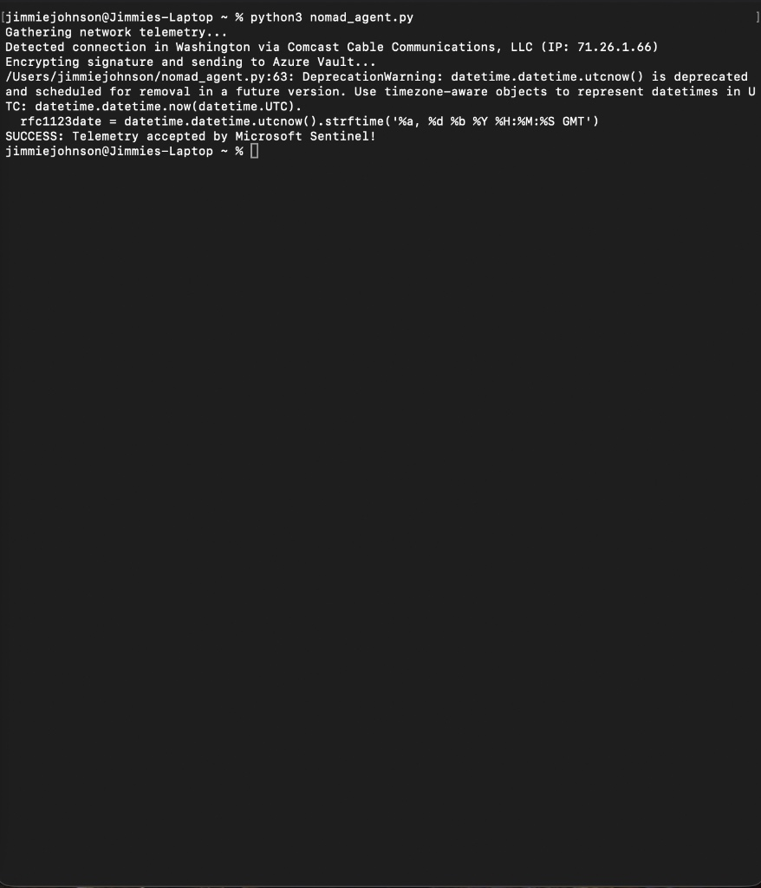
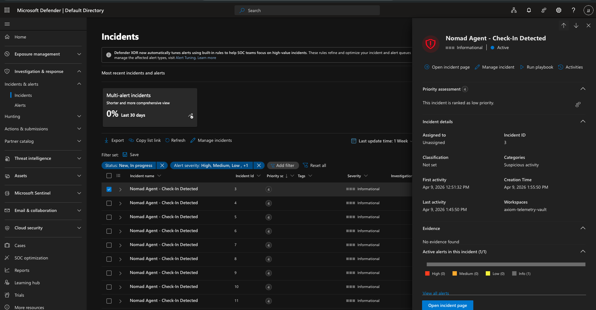

# Custom Threat Intelligence Telemetry Agent

## Objective
The goal of this project was to engineer a custom data ingestion pipeline to feed non-standard endpoint telemetry into a cloud SIEM (Microsoft Sentinel). This allows the Security Operations Center (SOC) to monitor, hunt, and alert on custom data sources that do not have native integration agents.

## Architecture & Skills Demonstrated
* **Languages:** Python 3, KQL (Kusto Query Language)
* **Cloud Platform:** Microsoft Azure (Log Analytics Workspace, Microsoft Sentinel, Defender XDR)
* **Core Concepts:** REST API integration, HMAC-SHA256 Cryptography, JSON payload structuring, SIEM Log Analytics, Detection Engineering (Analytics Rules).

## The Pipeline Flow
1. **Endpoint Execution:** A Python script (`nomad_agent.py`) executes on the target endpoint (macOS M3) to gather local public IP and ISP routing data.
2. **Cryptographic Authentication:** The script dynamically generates an HMAC-SHA256 signature based on the Azure Primary Key and current UTC timestamp to securely authenticate the payload.
3. **API Ingestion:** The payload is securely transmitted via `POST` request to the Azure Log Analytics REST API.
4. **Data Normalization:** Azure parses the JSON payload and populates a custom logging table (`NomadMacTelemetry_CL`).
5. **Detection & Alerting:** A Microsoft Sentinel Analytics Rule runs a scheduled KQL query against the custom table. If a specific condition is met, an automated Security Incident is generated in the Defender XDR queue for immediate SOC triage.

## KQL Hunting Query Example
The following Kusto query is used by the Sentinel Analytics Rule to detect recent check-ins and parse the custom telemetry:

```kusto
NomadMacTelemetry_CL
| where TimeGenerated > ago(1h)

| project TimeGenerated, DeviceName_s, PublicIP_s, City_s, ISP_s
## Proof of Execution
Here is the script successfully authenticating and transmitting the payload from the macOS endpoint:


Here is the automated Incident triggered in the Microsoft Defender XDR queue by the custom Sentinel Analytics Rule:


---

## Version 1.1 Update: Active Process Hunting 
**Upgrade:** Engineered a new Python logic block utilizing the `subprocess` module to actively parse the macOS process tree. 
**Result:** The SIEM no longer just knows *where* the endpoint is; it knows exactly *what* is running on it in real-time. Malicious background processes are immediately packaged into the JSON envelope and flagged in the Defender XDR queue.

**Proof of Execution (V1.1):**
Here is the endpoint actively hunting and packaging the processes:


Here is the custom KQL query proving the process array successfully ingested into the Azure Log Analytics Workspace:

